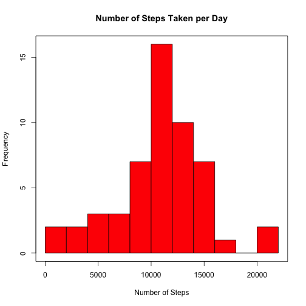
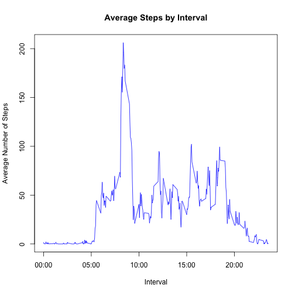
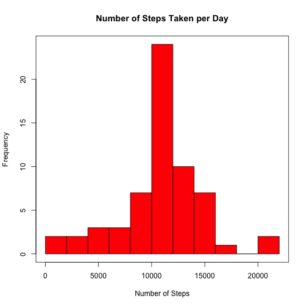
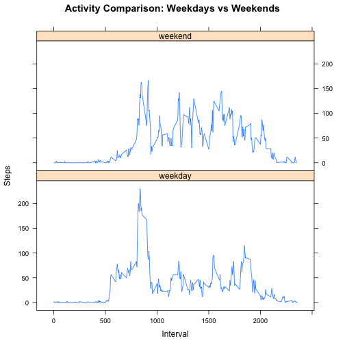

Reproducible Research: Peer Assessment 1
========================================
    
      
### Analysis Overview
This analysis examines personal movement data collected from an activity monitoring device.  The device records the number of steps taken by an individual at 5-minute intervals throughout the day.  Data used for this analysis correspond to activity in October and November 2012.


### Section A:  Load data from the "activity" dataset:

```r
if (!file.exists("activity.csv")) {
 unzip("activity.zip")
}
act <- read.csv("activity.csv",stringsAsFactors=FALSE)
```


### Section B: What is the mean total number of steps taken per day?    

```r
num_steps  <- aggregate(steps~date, data=act, sum, na.rm=TRUE)
mean_steps <- mean(num_steps$steps)   
med_steps  <- median(num_steps$steps)  
hist(num_steps$steps, breaks="FD", main="Number of Steps Taken per Day", xlab="Number of Steps", col="red")  
box()
```

 

The mean and median number of steps taken per day are 10766.19 and 10765, respectively.  Observations with missing values were not included in the calculation.


### Section C: What is the average daily activity pattern?      

```r
act$fmt_interval <- sprintf("%04d", act$interval)
avg_steps <- aggregate(steps~fmt_interval, data=act, mean, na.rm=TRUE)

# interval with the maximum number of steps, averaged across all days
max_int <- subset(avg_steps, steps==max(steps), select=c(fmt_interval)) 
fmt_max_int <- paste(substring(max_int,1,2), ":", substring(max_int,3,4), sep="")

plot(avg_steps$fmt_interval, avg_steps$steps, type='l', xaxt='n', main='Average Steps by Interval',
  xlab='Interval', ylab='Average Number of Steps', col='blue')  
axis(side=1, at=c(0,500,1000,1500,2000), labels=c("00:00", "05:00", "10:00", "15:00", "20:00"))
```

 


The interval which contains the maximum number of steps, averaged across all days, is interval 08:35.


### Section D: Imputing Missing Values 

```r
num_miss <- sum(!complete.cases(act))
```

The number of observations with missing values is 2304.  
In this analysis, missing values will be imputed using the mean number of steps, averaged across all days, for a given 5-minute interval. These are the averages found in data frame avg_steps.


```r
combine           <- merge(act, avg_steps, by="fmt_interval")
combine$steps     <- ifelse(is.na(combine$steps.x), combine$steps.y, combine$steps.x)
act_new           <- subset(combine, select=c(steps, date, fmt_interval))
names(act_new)[3] <- "interval"
```

Histogram using newly created dataset "act_new" with missing values imputed:


```r
num_steps_new <- aggregate(steps~date, data=act_new, sum, na.rm=TRUE)
mean_steps_new <- mean(num_steps_new$steps)   
med_steps_new  <- median(num_steps_new$steps)  
hist(num_steps_new$steps, breaks="FD", main="Number of Steps Taken per Day",
  xlab="Number of Steps", col="red")   
box()
```

 

The mean and median number of steps taken per day are 10766.19 and 10766.19, respectively. The mean is equal to the value computed in Section B.  The median, however, changed slightly from 10765 to 10766.19.  Thus, imputing missing values using the mean number of steps, averaged across all days, for a given 5-minute interval changed the distribution of the data slightly.  


### Section E: Are there differences in activity patterns between weekdays and weekends?

```r
library(lattice)
# create factor variable indicating weekday/weekend
act_new$day_of_week <- weekdays(as.Date(act_new$date))
act_new$week_ind <- factor(ifelse(act_new$day_of_week %in% c("Saturday","Sunday"), "weekend", "weekday"))

# plot to show activity by week indicator
panel_dat <- aggregate(act_new$steps, by=list(act_new$interval,act_new$week_ind), mean, na.rm=TRUE)
names(panel_dat)[1] <- "interval"
names(panel_dat)[2] <- "wkind"
names(panel_dat)[3] <- "steps"

xyplot(steps ~ as.numeric(interval) | wkind, type="l", data=panel_dat, layout=c(1,2),
    xlab="Interval", ylab="Steps", main="Activity Comparison: Weekdays vs Weekends")
```

 

The plots show differences in activity patterns between weekdays and weekends, with higher activity occuring on weekends.       


